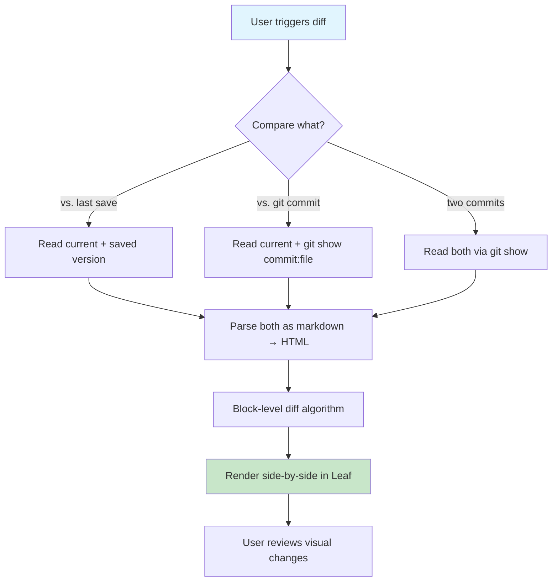
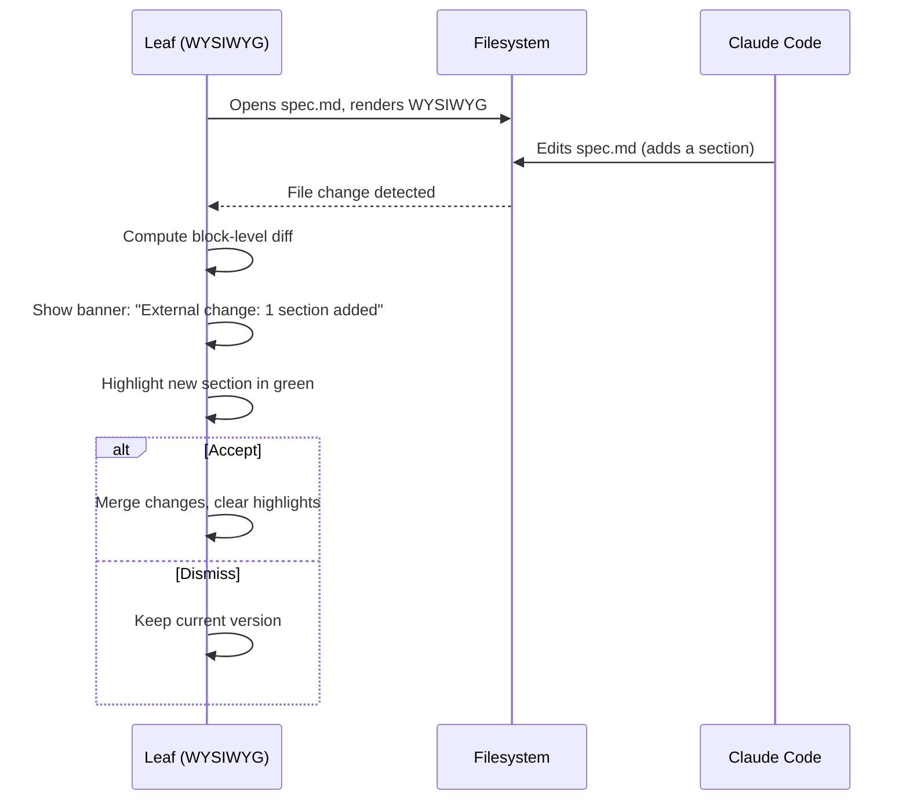
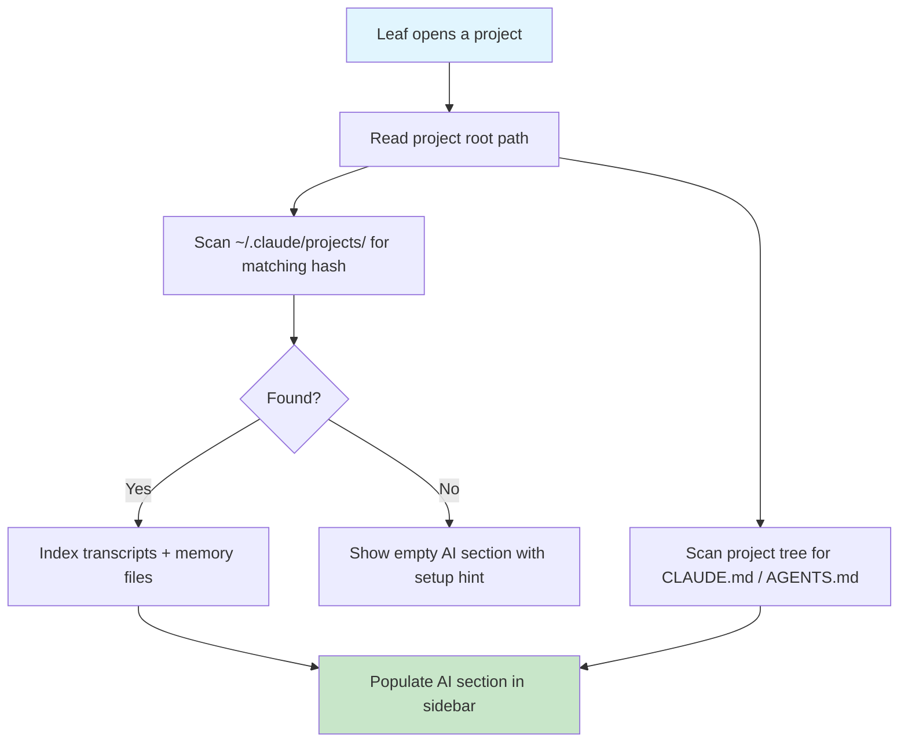

# Leaf — Roadmap

> **Thesis:** Leaf is the **reading and writing surface for the human side of AI-assisted
> development.** IDEs are where code lives. AI terminals are where conversations happen.
> Leaf is where the *documents* live — specs, instructions, transcripts, changelogs, reviews.
>
> Leaf should NOT duplicate IDE features (search across files, git blame, code execution,
> snippets). It should do what IDEs fundamentally can't: provide a beautiful, focused,
> WYSIWYG environment for the human-readable artifacts that bridge developers and AI.
>
> **The wedge:** You're in Claude Code in your terminal. Your IDE has the code open. Leaf is
> the third screen — where you read what the AI produced, write what you want the AI to do
> next, and publish the results for your team.

---

## Scoring Guide

| Dimension | Scale | Meaning |
|---|---|---|
| **Confidence** | 1–5 | How sure are we this is worth building? (5 = no-brainer) |
| **Complexity** | S / M / L / XL | Engineering effort (S = days, M = 1-2 weeks, L = 3-4 weeks, XL = 6+ weeks) |
| **ROI** | Low / Med / High / Critical | Value delivered relative to effort |
| **IDE Overlap** | None / Low / Med / High | How much does an IDE+plugins already solve this? |

---

## Feature 1: AI Session Transcript Viewer

| Dimension | Score |
|---|---|
| Confidence | 5 |
| Complexity | M |
| ROI | **Critical** |
| IDE Overlap | **None** |

### Intent

Claude Code saves conversation transcripts as JSONL in `~/.claude/projects/`. These are the
richest record of what happened in an AI session — but completely unreadable as raw JSON.
No tool renders these. Leaf should be the first.

### Job to Be Done

*"I had a long Claude Code session. I want to review what happened — decisions made, files
changed, mistakes caught — as a readable document, not a wall of JSON."*

### Why Not an IDE?

IDEs don't know what Claude Code transcripts are. They'd show raw JSONL. Even if someone wrote
a VS Code extension for this, it would be a panel crammed into the IDE — not a focused reading
experience. Leaf's WYSIWYG rendering engine is purpose-built for making structured content
beautiful and navigable.

### What It Does

- Open `.jsonl` transcript files directly in Leaf
- Render as a conversation: human messages, AI responses, collapsible tool calls
- Syntax-highlighted code blocks within AI messages
- **Session summary panel:** files touched, duration, token count, outcome
- **Decision log extraction:** pull out key decisions and rationale automatically
  (heuristic: look for "I'll do X because Y" patterns in AI responses)
- **Export as markdown** — turn a session into a shareable document
- **Multi-session timeline** — browse all sessions for a project, see what happened over time

### Wireframe Notes

```
┌─────────────────────────────────────────────────────┐
│ 📋 Sessions for typora-clone               [Leaf]   │
├──────────┬──────────────────────────────────────────┤
│ Sessions │                                          │
│          │  Session: Mar 10, 10:32 AM               │
│ Mar 10 ● │  Duration: 23 min · 45.2k tokens         │
│ Mar 9  ● │  Files: 4 modified, 1 created            │
│ Mar 8  ○ │  ─────────────────────────────────        │
│ Mar 7  ● │                                          │
│          │  👤 10:32 AM                               │
│ ──────── │  Add a copy-as-markdown button to the    │
│ Summary  │  status bar                              │
│          │                                          │
│ Files:   │  🤖 10:32 AM                              │
│  4 mod.  │  I'll implement that. Let me read the    │
│  1 new   │  relevant files first.                   │
│          │                                          │
│ Decisions│  ▶ Read StatusBar.vue           [expand] │
│ · Used   │  ▶ Read tabs.ts                [expand] │
│   Pinia  │  ▶ Edit StatusBar.vue           [expand] │
│   not    │                                          │
│   event  │  ✅ Done. Added a "Copy MD" button that   │
│   bus    │  uses the existing htmlToMarkdown util.  │
└──────────┴──────────────────────────────────────────┘
```

### Implementation Notes

- JSONL parsing: each line is JSON with `type`, `role`, `content`, `tool_use`
- Dedicated `TranscriptViewer.vue` — NOT a Tiptap extension (read-only structured data)
- File detection: `.jsonl` extension + sniff first line for Claude transcript shape
- Session index: scan `~/.claude/projects/<project>/` for all `.jsonl` files
- Decision extraction: regex/heuristic on assistant messages for rationale patterns
- Collapsible tool calls: most of the visual noise is tool results — collapse by default
- Export: walk rendered structure → emit markdown string

---

## Feature 2: Rendered Markdown Diff

| Dimension | Score |
|---|---|
| Confidence | 5 |
| Complexity | M |
| ROI | **Critical** |
| IDE Overlap | **None** |

### Intent

Show how a markdown document *looks* different, not how the source changed. `git diff` shows
you that line 47 changed from `| foo | bar |` to `| foo | bar | baz |`. Leaf shows you that
a table got a new column, a heading was reworded, an image was swapped.

### Job to Be Done

*"Claude Code just updated my README. I want to see what it looks like now vs. before — not a
source diff, but a visual 'before and after' of the rendered document."*

### Why Not an IDE?

IDEs diff source code. They show you line-level text changes. For markdown, this means you see
raw markup diffs (`**bold**` → `**new bold**`) rather than the rendered result. GitHub's
"rich diff" for markdown is the closest thing, but it's in a browser, not your local editor,
and it only works for committed changes.

### What It Does

- **Visual diff mode:** side-by-side or inline rendered diff of any two versions
- Compare: current vs. last save, current vs. any git commit, two arbitrary commits
- Highlights at the block level: added paragraphs (green), removed (red), changed (yellow)
- Table diffs show added/removed columns and rows visually
- Image diffs show old and new side-by-side
- Triggered by: menu item, keyboard shortcut, or from the External Edit notification

### Workflow



### Implementation Notes

- Diff engine: operate on rendered HTML blocks, not raw text lines
  - Parse both versions with markdown-it (already have it)
  - Diff at the block element level (paragraphs, headings, list items, table rows)
  - Use a tree-diff algorithm (e.g., `fast-diff` on text content per block)
- Render: dedicated `DiffViewer.vue` component with two Tiptap instances (read-only)
  or a single instance with diff decorations
- Git integration: Tauri command to run `git show <ref>:<path>` for historical versions
- This is a Leaf-only capability — no IDE does rendered markdown diffing

---

## Feature 3: Document Publishing Pipeline

| Dimension | Score |
|---|---|
| Confidence | 4 |
| Complexity | M |
| ROI | **High** |
| IDE Overlap | **None** |

### Intent

One-click export from Leaf's WYSIWYG view to polished output formats: PDF, standalone HTML,
or clipboard-ready rich text for pasting into Slack/Notion/Confluence. IDEs don't publish
documents — they edit code. This is firmly "document tool" territory.

### Job to Be Done

*"I wrote a spec in markdown. Now I need to share it with my team on Confluence and send a
summary to Slack. I don't want to manually format it in three different tools."*

### Why Not an IDE?

IDEs are authoring tools, not publishing tools. VS Code can preview markdown but can't
export to PDF with proper typography, headers/footers, and page breaks. You'd need Pandoc
on the command line or a separate tool. Leaf should make this one click.

### What It Does

- **Export to PDF** — proper typography, page breaks, table of contents, headers/footers
- **Export to HTML** — self-contained single file with embedded styles
- **Copy as rich text** — paste into Slack, Notion, Google Docs with formatting preserved
- **Copy as markdown** (already exists — extend it)
- **Template system** — choose export styles: "clean", "technical", "presentation"
- Mermaid diagrams and math render correctly in all export formats

### Implementation Notes

- PDF: Tauri can invoke system `print-to-pdf` via webview, or use Pandoc if installed
- HTML export: serialize the Tiptap document with embedded CSS from current theme
- Rich text copy: already partially working (copy-as-markdown exists) — extend with
  `text/html` MIME type on clipboard for rich paste
- Mermaid/KaTeX: must pre-render to SVG/HTML before export (they're lazy-loaded in-app)
- Template styles: CSS variations applied during export
- Consider: Pandoc detection (optional enhancement, not required for core functionality)

---

## Feature 4: AI Instruction Authoring Studio

| Dimension | Score |
|---|---|
| Confidence | 4 |
| Complexity | M |
| ROI | **High** |
| IDE Overlap | **Low** |

### Intent

Reframed from "CLAUDE.md Intelligence." Claude Code can validate its own instructions — Leaf
shouldn't duplicate that. Instead, Leaf should be the best *authoring environment* for AI
instruction files, leveraging its WYSIWYG strength.

### Job to Be Done

*"I'm a PM, not a developer. I need to write a CLAUDE.md that gives the AI clear instructions
for our project. I want guided authoring with templates and structure — not a blank file in
VS Code."*

### Why Not an IDE?

In an IDE, CLAUDE.md is just another text file. You're staring at raw markdown in a monospace
font next to your code. For a PM or non-dev writing AI instructions, this is hostile. Leaf
renders it beautifully and provides guided structure — closer to writing in Notion than
editing source code.

### What It Does

- **Guided CLAUDE.md builder** — step-by-step wizard: "What's your tech stack?" → generates
  section. "Any common mistakes to warn about?" → generates section. Builds the file
  interactively.
- **Template gallery** — pre-built CLAUDE.md templates for common stacks (Next.js, Django,
  Tauri, Rust CLI, etc.). Start from a template, customize.
- **Inheritance preview** — visualize how global, project, and subdirectory instruction files
  compose. Rendered as a layered view showing the final "merged" result an AI will see.
- **Cross-format support** — author once, export to CLAUDE.md, `.cursorrules`,
  `.github/copilot-instructions.md` (these are all markdown with slightly different conventions)
- **NOT validation** — that's the AI's job. Leaf helps you write, not grade.

### Wireframe Notes

```
┌─────────────────────────────────────────────────────┐
│ CLAUDE.md Builder                            [Leaf] │
├─────────────────────────────────────────────────────┤
│                                                     │
│  Let's build your AI instructions.                  │
│                                                     │
│  Step 1 of 5: Tech Stack                            │
│  ┌───────────────────────────────────────────────┐  │
│  │ Framework:  [Vue 3          ▾]                │  │
│  │ Language:   [TypeScript     ▾]                │  │
│  │ Bundler:    [Vite           ▾]                │  │
│  │ Testing:    [Vitest         ▾]                │  │
│  │ Other:      [Tauri, Pinia               ]     │  │
│  └───────────────────────────────────────────────┘  │
│                                                     │
│  Preview:                                           │
│  ┌─ ─ ─ ─ ─ ─ ─ ─ ─ ─ ─ ─ ─ ─ ─ ─ ─ ─ ─ ─ ─ ┐  │
│  │ ## Tech Stack                                │  │
│  │ - **Framework:** Vue 3 + TypeScript (strict) │  │
│  │ - **Bundler:** Vite                          │  │
│  │ - **Testing:** Vitest                        │  │
│  │ - **Other:** Tauri 2 (Rust), Pinia           │  │
│  └─ ─ ─ ─ ─ ─ ─ ─ ─ ─ ─ ─ ─ ─ ─ ─ ─ ─ ─ ─ ─ ┘  │
│                                        [Next →]     │
└─────────────────────────────────────────────────────┘
```

### Implementation Notes

- Wizard: multi-step Vue component, NOT a Tiptap extension
- Templates: bundled markdown files in `src/assets/templates/claude-md/`
- Inheritance preview: Tauri `fs` reads `~/.claude/CLAUDE.md` + project + subdirectory files,
  renders merged output in a read-only pane
- Cross-format export: minimal string transforms (header format, file naming)
- Key insight: this is a FORM that outputs markdown, not markdown with validation

---

## Feature 5: Visual Diff on External File Change

| Dimension | Score |
|---|---|
| Confidence | 4 |
| Complexity | S |
| ROI | **High** |
| IDE Overlap | **Low** |

### Intent

Narrowed from "External Edit Overlay." VS Code already detects external changes and offers
reload. The unique Leaf angle: show the diff **in the rendered WYSIWYG view**, not as source
code. You see the document change visually — a paragraph got reworded, a section was added.

### Job to Be Done

*"Claude Code just edited the spec I have open. I want to see what changed in the nicely
rendered view — not flip to a terminal and run `git diff`."*

### Why Not an IDE?

VS Code shows "this file changed on disk" and offers to reload. If you want a diff, it's a
source diff in the diff editor. Leaf shows you the rendered document with change highlights —
"this paragraph was reworded" shown visually in the WYSIWYG, not as `- old line` / `+ new line`.

### What It Does

- Detect file change (already implemented — live reload exists)
- Instead of silent reload: show a banner with summary ("3 blocks changed")
- Inline rendered diff highlights in the WYSIWYG view (green/red/yellow backgrounds)
- Accept all / Review each / Dismiss
- Pairs naturally with Feature 2 (Rendered Diff) — reuses the same diff engine

### Workflow



### Implementation Notes

- File watching: already exists in `src/App.vue`
- Diff engine: shared with Feature 2 (block-level markdown diff)
- Banner: simple Vue component at top of editor
- Highlight decorations: Tiptap `Decoration` plugin for WYSIWYG, CodeMirror `StateField` for source
- Complexity is S if we build Feature 2 first (reuses diff engine), M if standalone

---

## Feature 6: AI Session Flight Recorder

| Dimension | Score |
|---|---|
| Confidence | 4 |
| Complexity | L |
| ROI | **High** |
| IDE Overlap | **None** |

### Intent

A project-level dashboard of all AI sessions: what happened, what changed, how much it cost.
The "manager's view" of AI-assisted development. Feature 1 (Transcript Viewer) shows one
session in detail. This shows the big picture across sessions.

### Job to Be Done

*"I've been using Claude Code on this project for a month. I want to see: how many sessions,
total tokens spent, which files get touched most, what the major milestones were. Like a flight
recorder for my AI-assisted development."*

### Why Not an IDE?

IDEs don't know AI sessions exist. They see files and git history, not the conversations and
decisions that led to changes. This is a fundamentally new view that only makes sense if you
understand the AI session format.

### What It Does

- **Session timeline:** chronological list of all sessions for a project
- **Aggregate stats:** total tokens, total sessions, average session length
- **File heatmap:** which files were touched most across all sessions (most-edited = hottest)
- **Milestone markers:** sessions where major features were completed (detected by commit messages
  or session length/file count thresholds)
- **Cost tracking:** estimated cost per session (tokens × rate) and cumulative project cost
- **Filterable:** by date range, by files touched, by session outcome (success/abandoned)

### Wireframe Notes

```
┌─────────────────────────────────────────────────────┐
│ 📊 Flight Recorder: typora-clone             [Leaf] │
├─────────────────────────────────────────────────────┤
│                                                     │
│  Mar 2026         32 sessions · 1.2M tokens · ~$18  │
│  ═══════════════════════════════════════════════     │
│                                                     │
│  File Heatmap           Session Timeline            │
│  ┌────────────────┐     ┌─────────────────────────┐ │
│  │ Editor.vue ████│     │ Mar 10 ● README update  │ │
│  │ StatusBar  ███ │     │ Mar 9  ● line wrapping  │ │
│  │ tabs.ts    ██  │     │ Mar 8  ● copy markdown  │ │
│  │ App.vue    ██  │     │ Mar 7  ● drag-and-drop  │ │
│  │ style.css  █   │     │ Mar 6  ○ (abandoned)    │ │
│  └────────────────┘     └─────────────────────────┘ │
│                                                     │
│  Click any session to open in Transcript Viewer →   │
│                                                     │
└─────────────────────────────────────────────────────┘
```

### Implementation Notes

- Data source: scan `~/.claude/projects/<project-hash>/` for all `.jsonl` files
- Token counting: sum `usage` fields from transcript entries
- File extraction: parse `tool_use` entries for Read/Write/Edit tool calls
- Cost estimation: configurable token rates in Leaf preferences
- Timeline: Vue component, NOT Tiptap — this is a dashboard, not a document
- Milestone detection: heuristic — sessions with 5+ file edits or that end with git commits
- Links to Feature 1 (Transcript Viewer) for drill-down into individual sessions
- Consider: could be a sidebar panel or a dedicated full-screen view

---

## Feature 7: Margin Annotations

| Dimension | Score |
|---|---|
| Confidence | 3 |
| Complexity | L |
| ROI | **Med** |
| IDE Overlap | **None** |

### Intent

Add review comments in the document margin — like Google Docs comments but for local markdown
files. Stored as HTML comments in the file so they survive git commits and are invisible to
standard markdown renderers.

### Job to Be Done

*"I'm reviewing a spec that Claude Code wrote. I want to leave comments on specific paragraphs —
'this needs more detail', 'check this assumption' — without editing the actual content. And I
want those comments to persist in the file."*

### Why Not an IDE?

IDEs have no concept of document-level review comments. Code review happens on GitHub/GitLab.
But for markdown specs and docs that live in your repo, there's no way to annotate without
editing the content. Google Docs has comments, but you can't use Google Docs with git.
This bridges that gap.

### What It Does

- Click in the margin → add a comment attached to a specific block
- Comments render as margin callouts (like Word/Docs review mode)
- **Stored as HTML comments** in the markdown file: `<!-- @annotation: This needs detail -->`
- Invisible when rendered on GitHub, in other editors, or in standard markdown viewers
- Comment thread support: reply to annotations
- Resolve/unresolve workflow
- Filter: show all / unresolved only / hide all

### Wireframe Notes

```
┌───────────────────────────────────────────┬──────────┐
│                                           │ Comments │
│  ## Authentication Flow                   │          │
│                                           │ 💬 "Is   │
│  Users authenticate via OAuth 2.0 with ◄──│ this     │
│  Google as the identity provider.         │ Google   │
│                                           │ only?    │
│  ### Token Refresh                        │ What     │
│                                           │ about    │
│  Tokens are refreshed automatically       │ GitHub?" │
│  every 30 minutes using the refresh    ◄──│          │
│  token stored in the secure keychain.     │ 💬 "30   │
│                                           │ min      │
│                                           │ seems    │
│                                           │ short"   │
└───────────────────────────────────────────┴──────────┘
```

### Storage Format

```markdown
Users authenticate via OAuth 2.0 with Google as the identity provider.
<!-- @leaf-annotation {"author":"gautam","date":"2026-03-10","status":"open"}
Is this Google only? What about GitHub?
-->
```

### Implementation Notes

- Tiptap extension: custom `Annotation` node that wraps HTML comments
- Parse existing annotations on file open (regex for `<!-- @leaf-annotation ... -->`)
- Margin rendering: absolute-positioned panel to the right of the editor
- Storage: HTML comments are the most git-friendly approach — no sidecar files
- Thread support: nested annotations in the same comment block
- Challenge: maintaining annotation position when content shifts
- Consider: this is complex (L) and could be phased. Phase 1: simple non-threaded comments

---

## Feature 8: AI-Aware Sidebar with Pinned Folders

| Dimension | Score |
|---|---|
| Confidence | 5 |
| Complexity | S |
| ROI | **Critical** |
| IDE Overlap | **None** |

### Intent

The sidebar file tree is the navigation layer for everything else in this roadmap. Today it
shows the current project directory. It should also surface AI-related files — transcripts,
CLAUDE.md at every level, memory files — as a dedicated section, plus let users pin any
directory (like `~/specs/` or a shared docs folder).

### Job to Be Done

*"I want to browse my Claude Code session transcripts, check my global CLAUDE.md, and open
my project's memory files — without leaving Leaf or navigating to hidden dotfile directories
in Finder."*

### Why Not an IDE?

VS Code's file explorer shows one workspace root. To see `~/.claude/`, you'd need a multi-root
workspace (clunky, pollutes your project). VS Code also has no concept of "AI files" — it
doesn't know that `~/.claude/projects/abc123/session.jsonl` is a transcript for your current
project. Leaf can auto-discover this relationship and surface the right files automatically.

### What It Does

- **"AI" smart section** in the sidebar that auto-discovers and groups:
  - `~/.claude/CLAUDE.md` — global AI instructions
  - All `CLAUDE.md` / `AGENTS.md` files in the project tree (any depth)
  - `~/.claude/projects/<current-project>/` — session transcripts for this project
  - `~/.claude/projects/<current-project>/memory/` — auto-memory files
- **Pinned folders** — user can pin any directory to the sidebar (persisted in preferences)
  - Common use: `~/Documents/specs/`, a shared team docs folder, `~/.claude/`
  - Pinned folders appear as collapsible sections above the project tree
- **Smart project matching** — Leaf detects which `~/.claude/projects/<hash>/` directory
  corresponds to the current project (by matching the project path in Claude's config)
- **Quick access bar** — small icon row at the top: 📁 Project · 🤖 AI · 📌 Pinned · 📄 Outline

### Wireframe Notes

```
┌──────────────────────────────┐
│ 📁  🤖  📌  📄              │  ← section toggle icons
├──────────────────────────────┤
│ 🤖 AI Files                 │
│  ├─ 📋 Sessions (12)        │  ← transcripts for this project
│  │   ├─ Mar 10 — README...  │
│  │   ├─ Mar 9 — line wrap..│
│  │   └─ Mar 8 — copy mark..│
│  ├─ 📝 Instructions         │
│  │   ├─ CLAUDE.md (global)  │
│  │   ├─ CLAUDE.md (project) │
│  │   └─ src-tauri/CLAUDE.md │
│  └─ 🧠 Memory               │
│      └─ MEMORY.md            │
├──────────────────────────────┤
│ 📌 Pinned                   │
│  └─ ~/Documents/specs/      │
│      ├─ auth-spec.md        │
│      └─ api-design.md       │
├──────────────────────────────┤
│ 📁 typora-clone/            │
│  ├─ src/                    │
│  ├─ ROADMAP.md              │
│  ├─ README.md               │
│  └─ ...                     │
├──────────────────────────────┤
│ 📄 Outline                  │
│  ├─ # Leaf — Roadmap        │
│  ├─ ## Feature 1            │
│  └─ ## Feature 2            │
└──────────────────────────────┘
```

### Workflow: Auto-Discovery



### Implementation Notes

- **Project matching:** Claude Code stores project paths in `~/.claude/projects/` as directory
  names that are hashed from the project path. Read Claude's `projects.json` or reverse-match
  by scanning directory contents for path references.
- **Sidebar architecture:** current sidebar has file tree + outline as panels. Add two new
  panels: "AI" and "Pinned". Use the existing `Sidebar.vue` section pattern.
- **Pinned folders:** store paths in Leaf preferences (`src/stores/preferences.ts`). Persist
  via Tauri `fs` (already have preference persistence).
- **Transcript listing:** read directory contents via Tauri `fs.readDir()`, sort by mtime,
  show most recent first. Display first human message as preview text.
- **CLAUDE.md discovery:** recursive glob for `**/CLAUDE.md` and `**/AGENTS.md` in project,
  plus hardcoded `~/.claude/CLAUDE.md`.
- **Quick access bar:** 4 icon buttons that toggle which section is expanded. Lightweight —
  just toggles visibility of existing sections.
- Complexity is S because it's mostly new Vue components using existing Tauri fs APIs and
  the existing sidebar panel pattern. No new Tiptap extensions needed.

### Synergies

This feature is the **navigation backbone** for three other roadmap features:
- **F1 (Transcript Viewer):** click a session in the AI section → opens in Transcript Viewer
- **F6 (Flight Recorder):** the AI section's session list IS the lightweight version of the
  flight recorder; F6 adds the aggregate dashboard
- **F4 (AI Instruction Authoring):** click a CLAUDE.md in the AI section → opens in the
  authoring studio

Building this first makes F1, F4, and F6 more accessible and discoverable.

---

## Features Considered and Cut

These were in the original roadmap but overlap too heavily with IDE+plugin territory:

| Feature | Why Cut |
|---|---|
| **Git Blame per Paragraph** | GitLens in VS Code does this better with full IDE integration |
| **Multi-File Search/Replace** | VS Code's Cmd+Shift+H is best-in-class; can't compete |
| **Executable Code Blocks** | Jupyter notebooks, VS Code notebooks, Cursor — deeply IDE territory |
| **Document Statistics** | Dozens of VS Code extensions; Claude Code can analyze docs on demand |
| **Snippet System** | VS Code snippets + AI autocomplete make canned templates obsolete |
| **Spec Tracker** | Linear/Jira/Notion own this; Claude Code tracks its own progress |
| **Frontmatter Editor** | Obsidian does this; standalone value is low without a broader system |

**Guiding principle:** If you'd tell someone "just use VS Code + [plugin]" and it'd be 90%
as good, don't build it. Build what VS Code fundamentally can't do because it's a code editor,
not a document editor.

---

## Priority Matrix

```
                          High ROI
                            │
       ┌────────────────────┼────────────────────┐
       │                    │                    │
       │                    │  F8: AI Sidebar ★★ │
       │                    │  (build FIRST)     │
       │                    │                    │
       │                    │  F1: Transcript    │
       │                    │  Viewer ★          │
       │                    │                    │
       │   F7: Margin       │  F2: Rendered      │
       │   Annotations      │  Diff ★            │
Low    │                    │                    │  High
Conf   ├────────────────────┼────────────────────┤ Conf
       │                    │                    │
       │                    │  F3: Publishing    │
       │                    │  Pipeline          │
       │                    │                    │
       │                    │  F4: AI Instruct.  │
       │                    │  Authoring         │
       │                    │                    │
       │                    │  F5: Visual Ext.   │
       │                    │  Edit Diff         │
       │                    │                    │
       │                    │  F6: Flight        │
       │                    │  Recorder          │
       └────────────────────┼────────────────────┘
                            │
                          Low ROI

★  = Zero IDE overlap, critical ROI
★★ = Navigation backbone — unlocks F1, F4, F6
```

## Recommended Build Order

| Phase | Features | Rationale |
|---|---|---|
| **Phase 0: The backbone** | F8 (AI-Aware Sidebar) | S complexity, critical ROI. This is the navigation layer that makes F1, F4, and F6 discoverable. Build it first — everything else plugs into it. |
| **Phase 1: The moat** | F1 (Transcript Viewer), F2 (Rendered Diff) | Zero competition. These alone make Leaf worth using alongside an IDE. No other tool does either of these. F1 plugs directly into F8's session list. |
| **Phase 2: The workflow** | F5 (Visual External Edit), F3 (Publishing Pipeline) | Complete the "AI companion" story: see what changed (F5), share results (F3). F5 reuses F2's diff engine. |
| **Phase 3: The studio** | F4 (AI Instruction Authoring), F6 (Flight Recorder) | Power features for serious AI-assisted dev. F4 is the PM-friendly entry point. F6 is the ops dashboard. Both navigate from F8's AI section. |
| **Phase 4: Collaboration** | F7 (Margin Annotations) | High complexity, lower confidence. Build only after validating that people use Leaf for spec review. |

---

## Competitive Landscape

| Feature | Nearest Competitor | Why Leaf Wins |
|---|---|---|
| Transcript Viewer | None — JSONL files are unreadable | **100% novel.** First tool to make AI sessions reviewable. |
| Rendered Markdown Diff | GitHub rich diff (web only, committed changes only) | **Local + any version + WYSIWYG** — 30%+ better |
| Publishing Pipeline | Pandoc CLI, Marked.app | **Integrated in editor + WYSIWYG preview** — 25% less friction |
| AI Instruction Authoring | None — CLAUDE.md is hand-edited | **Guided builder for non-devs** — 100% novel for PMs |
| Visual External Edit Diff | VS Code (source diff only) | **Rendered WYSIWYG diff** — fundamentally different approach |
| Flight Recorder | None | **100% novel.** No tool tracks AI session history at project level. |
| Margin Annotations | Google Docs (not git-compatible) | **Git-native comments** in markdown — bridges Docs and code |
| AI-Aware Sidebar | VS Code multi-root workspace (clunky) | **Auto-discovers AI files** for current project — zero config |

---

## Anti-Goals

Things Leaf should explicitly NOT build:

- **Built-in AI chat** — Claude Code, Cursor, Copilot Chat already exist. Leaf is the reading
  surface, not another chat interface.
- **File tree search/replace** — VS Code's core competency. Use VS Code for this.
- **Code execution** — Jupyter, VS Code notebooks, the terminal. Not Leaf's job.
- **Git operations** — Leaf is not a git GUI. It reads git data (for diffs) but doesn't commit,
  branch, or merge.
- **Project management** — Linear, Jira, Notion. Leaf helps you write specs, not manage sprints.
